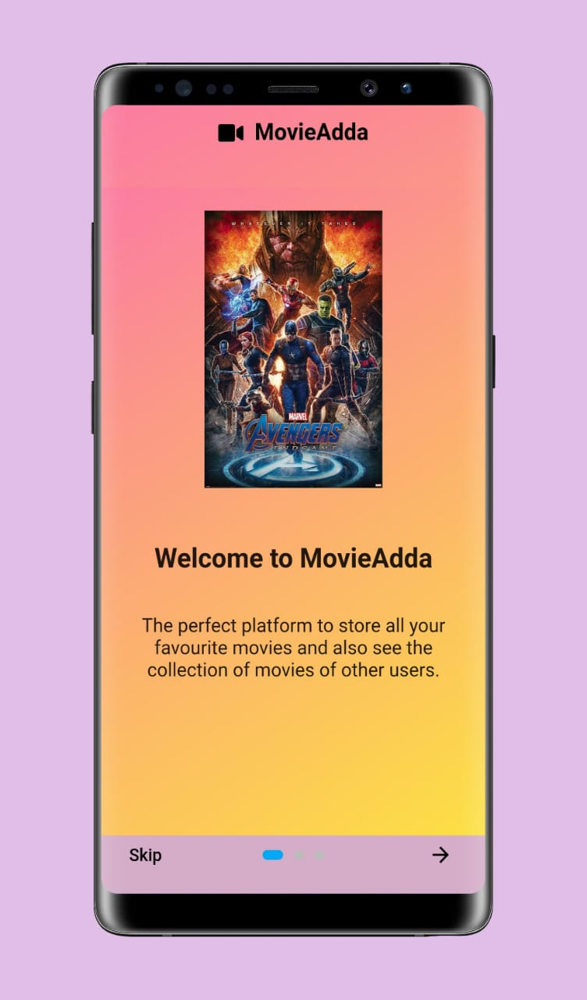
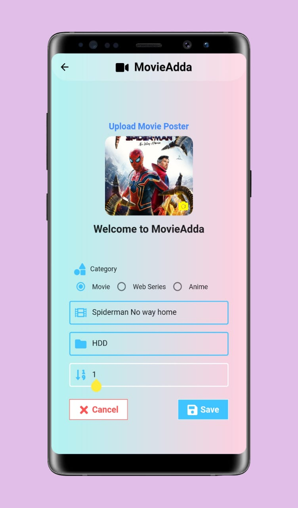
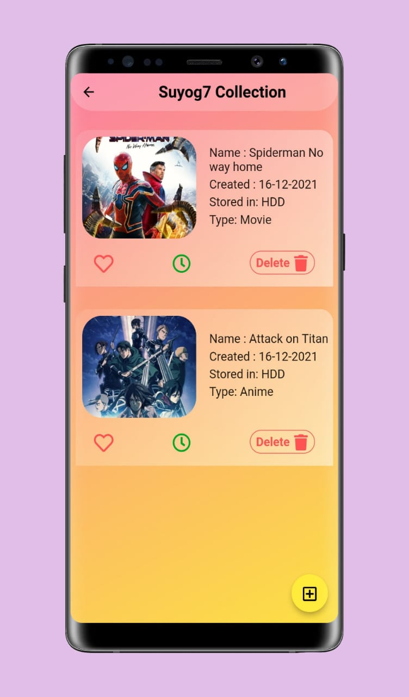
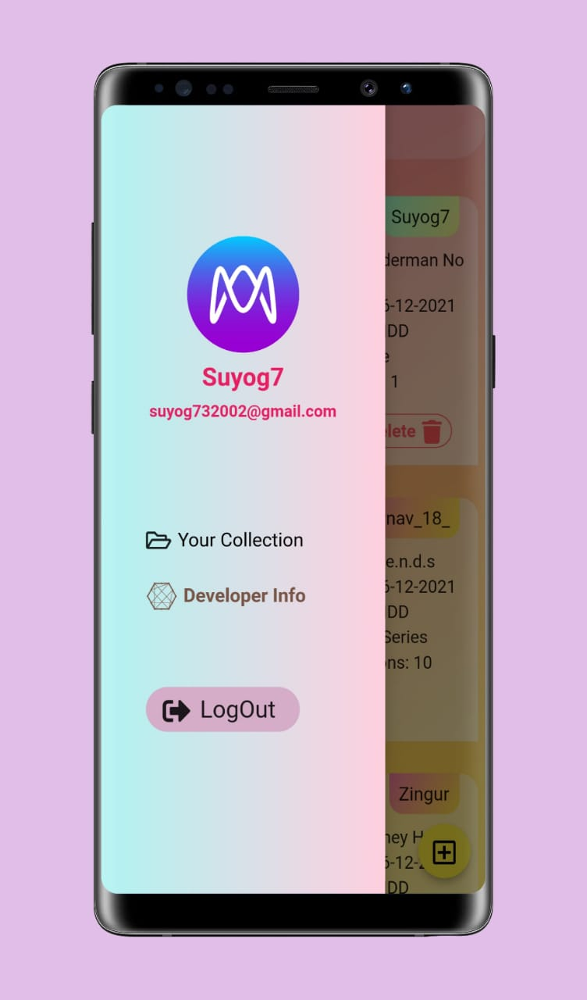
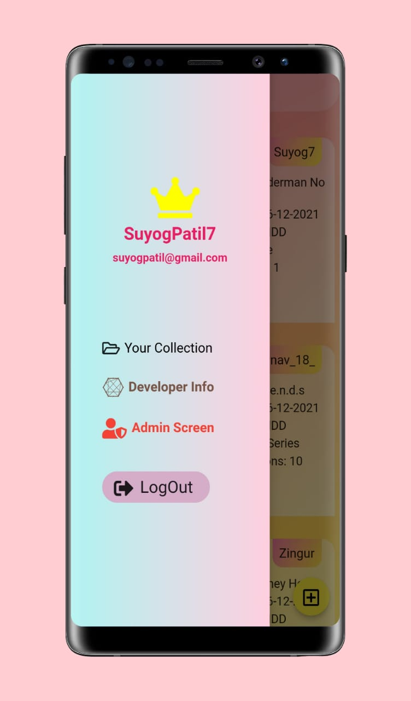

# MovieAdda

A simple app to store all your movies, web-series and animes in one place and also watch others collection of movies.

 

## App Screenshots
<table>
  <tr>
     <td align="center">Welcome Screen</td>
     <td align="center">Collection of Posts</td>
     <td align="center">Create new movie</td>
  </tr>
  <tr>
    <td></td>
    <td></td>
    <td></td>
  </tr>
 </table>

<table>
  <tr>
    <td align="center">See other's posts</td>
     <td align="center">Profile Info</td>
  </tr>
  <tr>
    <td></td>
    <td></td>
  </tr>
 </table>

 

### Admin Account 

(Only the users who are admin can access this screens)

<table>
  <tr>
    <td align="center">Admin Profile</td>
     <td align="center">User list</td>
     <td align="center">Admin can delete any user post</td>
  </tr>
  <tr>
    <td></td>
    <td></td>
    <td></td>
  </tr>
 </table>
 
 
    
 
You can download MovieAdda app from this link:- https://drive.google.com/file/d/1e8_d3nGwF-Jqes8UCG4IVIXrbTAbWp8o/view?usp=sharing

 Here are my some another projects using flutter:- https://drive.google.com/drive/folders/1nx7z0Fo52Rh1mFRPFonGMYulrT5CPgCz?usp=sharing
